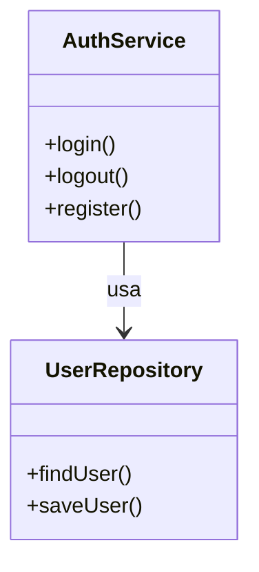

# Guia Completo para Iniciantes em C4 Model

O **C4 Model** é uma abordagem para modelar arquiteturas de software de forma visual, clara e incremental. Ele divide a documentação em quatro níveis de abstração, facilitando a comunicação entre desenvolvedores, arquitetos e stakeholders.

---

## Visão Geral dos Níveis do C4

1. **Contexto (System Context)**
2. **Contêineres (Containers)**
3. **Componentes (Components)**
4. **Código (Code)**

---

## 1. Diagrama de Contexto

### Objetivo
Mostrar o sistema como um todo, seus usuários e sistemas externos.

### Responsabilidades
- Definir fronteiras do sistema.
- Identificar atores externos (usuários, sistemas).
- Comunicar o propósito do sistema.

### Exemplo

  mermaid
    C4Context
    Person(user, "Usuário", "Pessoa que utiliza o sistema")
    System(system, "Biblioteca de Sophia", "Sistema de gerenciamento de biblioteca")
    System_Ext(externo, "Sistema de Pagamento", "Processa pagamentos de multas")
    
    user -> system : Usa
    system -> externo : Solicita pagamento

---

## 2. Diagrama de Contêineres

### Objetivo
Detalhar os principais contêineres (aplicações, bancos de dados, serviços) do sistema.

### Responsabilidades
- Mostrar como o sistema é dividido em aplicações e serviços.
- Explicar responsabilidades de cada contêiner.
- Ilustrar interações entre contêineres.

### Exemplo

    mermaid
        C4Container
        Person(user, "Usuário")
        System_Boundary(sistema, "Biblioteca de Sophia") {
            Container(web, "Web App", "React", "Interface do usuário")
            Container(api, "API", "Node.js", "Lógica de negócio")
            Container(db, "Banco de Dados", "PostgreSQL", "Armazena dados")
        }
        user -> web : Usa via navegador
        web -> api : Requisições HTTP
        api -> db : Consulta e grava dados

---

## 3. Diagrama de Componentes

### Objetivo
Detalhar os componentes internos de um contêiner.

### Responsabilidades
- Identificar módulos, serviços e bibliotecas.
- Explicar responsabilidades de cada componente.
- Mostrar interações internas.

### Exemplo

        mermaid
        C4Component
        Container(api, "API", "Node.js") {
            Component(auth, "AuthService", "Gerencia autenticação")
            Component(book, "BookService", "Gerencia livros")
            Component(user, "_UsuariorsService", "Gerencia usuários")
        }
        web -> auth : Login
        web -> book : Consulta livros
        web -> user : Cadastro de usuário

---

## 4. Diagrama de Código

### Objetivo
Detalhar a implementação de um componente específico.

### Responsabilidades
- Mostrar classes, funções e relacionamentos.
- Auxiliar desenvolvedores na compreensão do código.

### Exemplo

---

## Aplicabilidade

- **Comunicação:** Facilita o entendimento entre equipes técnicas e não técnicas.
- **Documentação:** Serve como documentação viva da arquitetura.
- **Manutenção:** Ajuda na evolução e manutenção do sistema.

---

## Dicas Práticas

- Comece pelo contexto e aprofunde conforme necessário.
- Use ferramentas como [Structurizr](https://structurizr.com/) ou [Mermaid](https://mermaid-js.github.io/) para diagramas.
- Mantenha os diagramas simples e focados no público-alvo.

---

## Referências

- [Site oficial do C4 Model](https://c4model.com/)
- [Documentação Mermaid C4](https://mermaid-js.github.io/mermaid/#/c4c4)
